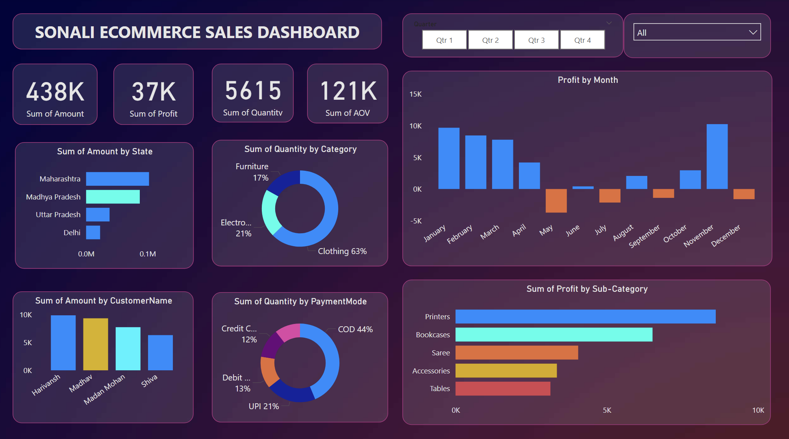

# 📊 Power BI Sales Dashboard

## 📌 Project Overview
This project is an interactive Sales Dashboard created using Microsoft Power BI.  
It analyzes sales, profit, and quantity data to identify trends and generate meaningful business insights.

## 🛠 Tools Used
- Microsoft Power BI  
- Power Query  
- Data Modeling (Relationships)  
- Basic DAX Measures  

## 📈 Key Features
- Monthly Sales Trend Analysis  
- Profit Analysis  
- Category-wise Performance  
- Interactive Filters (Slicers)  
- Bar, Line, and Donut Charts  

## 📷 Dashboard Preview

## 📚 What I Learned
- Creating relationships between multiple tables  
- Data cleaning and transformation  
- Building interactive dashboards  
- Generating business insights from data  
